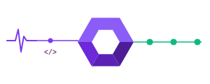

<p align="center">
  
</p>

<h1 align="center">GitWand</h1>

<p align="center">
  <strong>Git's magic wand — automatic conflict resolution</strong>
</p>

<p align="center">
  <a href="#installation">Installation</a> •
  <a href="#how-it-works">How it works</a> •
  <a href="#cli-usage">CLI</a> •
  <a href="#vs-code-extension">VS Code</a> •
  <a href="#roadmap">Roadmap</a>
</p>

<p align="center">
  
  
  
</p>

---

GitWand automatically resolves trivial Git merge conflicts — the ones that waste your time but don't need human judgment. Think of it as **PhpStorm's magic wand, everywhere**.

Run `gitwand resolve` after a merge or rebase, and let it handle the obvious stuff while you focus on the real conflicts.

## How it works

When Git reports merge conflicts, most of them fall into predictable patterns that don't actually need a human to decide. GitWand detects and resolves these automatically:

| Pattern | Description | Confidence |
|---|---|---|
| **Same change** | Both branches made the exact same edit | Certain |
| **One-side change** | Only one branch modified the block | Certain |
| **Delete + no change** | One branch deleted, the other didn't touch it | Certain |
| **Whitespace only** | Same code, different formatting | High |
| **Non-overlapping** | Additions at different locations (e.g. imports) | High |

Every auto-resolution comes with a human-readable explanation, so you can audit what happened:

```
✓ src/config.ts — 3/3 resolved
  L12 [one_side_change] auto — Only the incoming branch modified this block.
  L25 [same_change] auto — Both branches made the exact same edit.
  L41 [delete_no_change] auto — Current branch deleted this block, the other didn't touch it.
```

**Complex conflicts are never auto-resolved.** GitWand only touches what it's certain about.

## Installation

```bash
# Use directly with npx (no install needed)
npx @gitwand/cli resolve

# Or install globally
npm install -g @gitwand/cli
```

> Requires Node.js 18+

## CLI usage

```bash
# Resolve all conflicted files in the current repo
gitwand resolve

# Preview without writing files
gitwand resolve --dry-run

# Resolve specific files
gitwand resolve src/app.ts src/config.ts

# See detailed explanations
gitwand resolve --verbose

# Show conflict status for all files
gitwand status
```

### Example output

```
  ✨ GitWand — Git's magic wand

  4 file(s) in conflict

  ✓ src/components/Header.tsx — 2/2 resolved
  ✓ src/utils/config.ts — 3/3 resolved
  ◐ src/services/api.ts — 1/3 resolved
  ○ src/index.ts — no conflicts

  ─── Summary ───
  ✨ 6 conflict(s) auto-resolved out of 8
  2 conflict(s) remaining — manual resolution needed
```

## VS Code extension

> Coming soon — Phase 3

The extension will integrate directly into VS Code's merge workflow:

- **One-click resolve** — A "GitWand: Resolve" button in the merge editor
- **CodeLens** — Inline annotations above each conflict showing its type and resolution
- **Status bar** — Conflict count with auto-resolvable ratio
- **Diagnostics** — Inline hints for conflicts GitWand can handle

## Architecture

GitWand is a monorepo with a shared core engine:

```
gitwand/
├── packages/
│   ├── core/       @gitwand/core — Resolution engine (TypeScript)
│   ├── cli/        @gitwand/cli — Command-line interface
│   └── vscode/     VS Code extension (Phase 3)
├── apps/
│   └── desktop/    Standalone app — Tauri + Vue 3 (Phase 4)
└── ...
```

The core is framework-agnostic and can be used as a library:

```ts
import { resolve } from "@gitwand/core";

const result = resolve(conflictedFileContent, "src/app.ts");

console.log(`${result.stats.autoResolved}/${result.stats.totalConflicts} resolved`);

if (result.mergedContent) {
  // All conflicts resolved!
  fs.writeFileSync("src/app.ts", result.mergedContent);
}
```

## Roadmap

- [x] **Core engine** — Conflict parser + 5 resolution patterns
- [x] **CLI** — `gitwand resolve` and `gitwand status`
- [x] **Non-overlapping pattern** — Smart import merging (LCS-based 3-way diff)
- [ ] **VS Code extension** — CodeLens, status bar, one-click resolve
- [ ] **CI integration** — `gitwand resolve --ci` for automated pipelines
- [ ] **Desktop app** — Standalone 3-way merge editor (Tauri + Vue 3)
- [ ] **Plugin system** — Custom resolution strategies per language/framework

## Contributing

GitWand is open source under the MIT license. Contributions are welcome!

```bash
# Clone and setup
git clone https://github.com/devlint/GitWand.git
cd gitwand
pnpm install
pnpm build
pnpm test
```

## Why GitWand?

Merge conflicts are inevitable in teams. Good tools like PhpStorm handle them beautifully, but they're locked inside heavy IDEs. Simple tools like Meld are lightweight but entirely manual. AI-powered tools are emerging but immature and often require subscriptions.

GitWand sits in the sweet spot: **deterministic, fast, transparent, and free**. It resolves what's obvious and gets out of your way for the rest.

## License

MIT — [Laurent Guitton](https://github.com/devlint)
